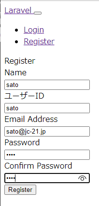
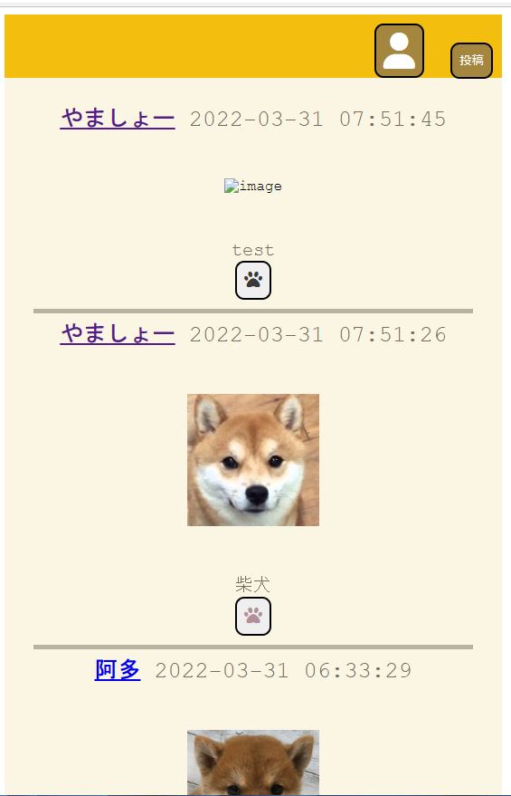
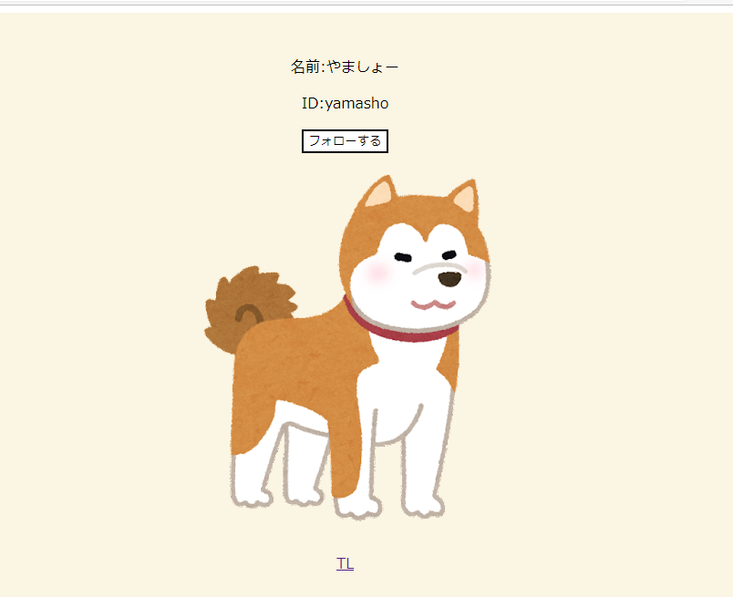
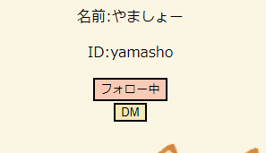

# Shibastagram

### **柴犬だけ**を投稿できるSNS
  

アプリの画面画像、動画追加予定

## 概要  
柴犬好きのための画像投稿アプリです。画像を選択し投稿ボタンを押すと、柴犬を学習した*AWS　Rekognition*が走り、柴犬かどうかを判定します。現在は、正面かつ一匹の写真のみ通ります。柴犬なら投稿が成功し、タイムラインへ反映されます。柴犬以外は表示されません。

## 画面画像
### 1.ホーム画面
アプリのホーム画面です。

### 2.新規登録画面
ユーザの新規登録画面です。パスワードが規定の文字数に満たない場合は2枚目のようになります。

 

↓やり直しの場合

### 3.タイムライン画面(いいね機能)
投稿された画像が柴犬でない場合、上の投稿のように画像が表示されなくなります。
肉球の形のボタンがいいねボタンになり、いいねをすると黒(上の投稿)からピンク(下の投稿)のように変わります。

### 4.他ユーザ(フォロー機能)
他の投稿者のページです。画面下部のTLをクリックするとタイムラインに戻ります。
このユーザをフォローすると2枚目の画像のようにDMボタンが現れます。

↓文字がフォロー中になり、DMボタンが現れる

## 使用したフレームワーク・言語・技術　
xampp v3.3.0  
laravel8  
PHP8  
python3.8  
AWS S3  
AWS Rekognition  
AWS Lambda  

## 今後実装したい機能　　
相互フォロー限定のDM機能　　

フォローしたユーザーの投稿をタイムラインのトップに表示　　

投稿にユーザーアイコンを表示　　

柴犬以外投稿できない仕様

柴犬と判定される範囲を広げる(横顔、二匹以上など)

